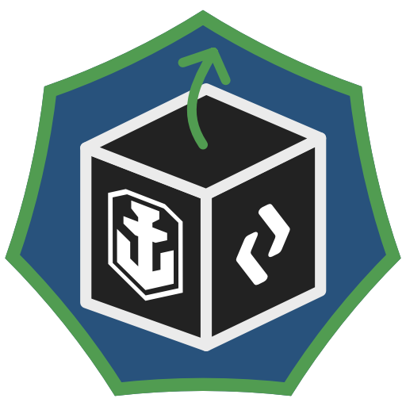

# WOWS Unpack

A project that provides a web API and C# data structures to process World of Warships replay files.

## API
An ASP.NET project providing a REST-API that can process an uploaded replay file and returns a json object with the extracted data.
Internally, the service runs a customized version of the [replays_unpack](https://github.com/Monstrofil/replays_unpack/) unpacker by Monstrofil written in Python.

## Client
A small utility package that contains a sample client implementation that can be used in any C# project to easily access the api without having to worry about assembling the required content for the request.

## Common
Contains Typesafe DTOs that allow processing the unpacking result in C# without having to process dynamic json objects.

## Roadmap
- **Replace the python unpacker with a C# version, developed as [WOWS-ReplayUnpack](https://github.com/Nodsoft/WoWS-ReplaysUnpack/)**
- Provide extended API, allowing to filter returned information
- Minimap-Rendering for replays
- Simple frontend for replay processing

## Contributing
If you want to contribute, please contact us on our Discord server, [Nodsoft Systems](https://discord.gg/PHWMKc2mth).
For now, the most important task will be converting the python unpacker to C# so basic python knowledge may be helpful.
